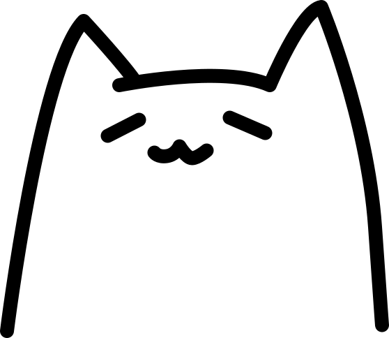

  

    

      
      <!--<h1><a href="" style="color:#ff4d8c">{{site.title}}</a><a href="/profile">Click!</a></h1>-->
      
    

  

  <section id="aboutme">
  
  

    <h3>三橋 優希 (みはし ゆうき)</h3>
    <i class="fas fa-map-marker-alt fa-fw"></i> 東京 
    <i class="fas fa-school fa-fw"></i> N高等学校 4期生 
    <i class="fas fa-tools fa-fw"></i> イラスト、UIデザイン、Webサイト制作 
    <i class="fas fa-envelope fa-fw"></i> {{site.email}} 
    <i class="fas fa-user fa-fw"></i> CoderDojoメンター / ECoder’s主宰 / 未踏ジュニア 2018年度 スーパークリエータ / SecHack365 2期 トレーニー
  

  </section>
<!--<section id="skill">
  
  

    
    <h3>{{work.name}}</h3>
  

  
</section>-->
<section id="Works">
  <h2 class="top-h2">WORK</h2>
  

  
  <a href="{{ site.baseurl }}{{ post.url }}" class="project">
    
    
    
    
    

      <h3>{{post.title}}</h3>
      

      
      
{{tag}}

      
      

    

  </a>
  
  

</section>
<section id="achievement">
  <h2 class="top-h2">ACHIEVEMENT</h2>
  <ul class="achi">
  
  <li>{{ achi.date }} {{achi.title}} <a href="{{ achi.url }}" target="_blank" class="achievement" rel="noopener">{{ achi.event }}</a></li>
  
  </ul>
</section>

<section id="Presentation">
  <h2 class="top-h2">PRESENTATION SLIDE</h2>
  

    
    <a href="{{ prs.url }}" target="_blank" class="prs" rel="noopener">
      

        
      

      

        {{ prs.title }} 
        {{ prs.date }}
      

    </a>
    
  

  <a href="https://speakerdeck.com/yuki384" class="button">もっと見る</a>
</section>
<section id="Blog">
  <h2 class="top-h2">BLOG</h2>
  
  <a href="{{ post.url }}">
  <article class="posts">
    

      <h3>{{post.date | date:"%Y/%m/%d"}}{{post.title}}</h3>
    

  </article>
  </a>
  
  <a href="{{site.url}}/blog" class="button">過去の記事を見る</a>
</section>
<section id="Articles">
  <h2 class="top-h2">ARTICLE</h2>
  <ul>
    
      <li><a href="{{article.url}}" target="_blank" rel="noopener">{{article.title}}</a></li>
    
  </ul>
</section>
<section>
  <h2 class="top-h2">GITHUB ACTIVITIES</h2>
  <a href="https://github.com/yuki384"><i class="fab fa-github"></i> yuki384</a>
</section>

